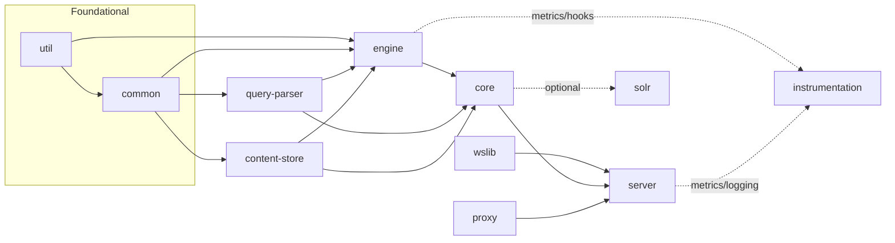
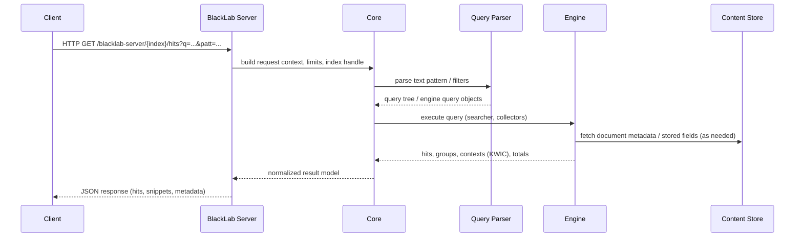
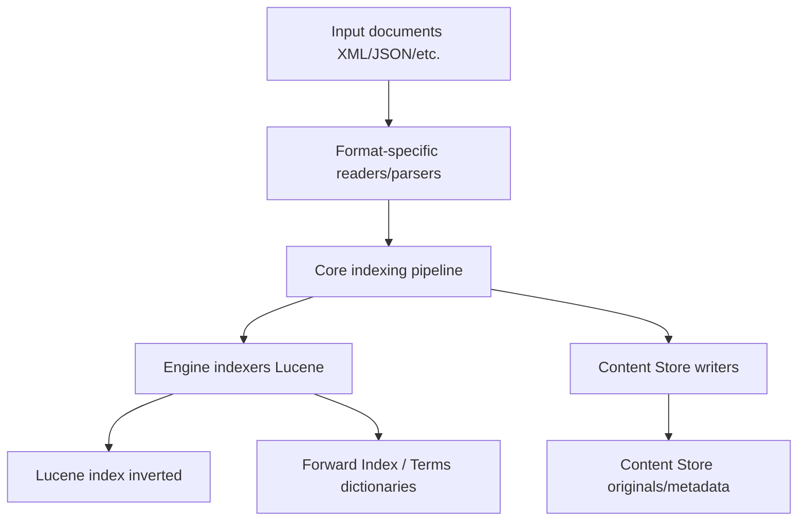

# BlackLab Architecture Overview

Last updated: 2025-08-08 18:27 local time

This document provides a high-level overview of the BlackLab architecture: its main modules, responsibilities, boundaries, and the typical data flows for indexing and query execution. It is intended for maintainers and contributors who need to understand how the codebase fits together and where to make changes safely.

Contents
- Components and module boundaries
- Dependency relations (what may depend on what)
- Query execution flow (request -> response)
- Indexing flow (documents -> index)
- Extension points and optional integrations

## Components and Module Boundaries

BlackLab is a multi-module Maven project. At a high level:
- util: low-level utilities with no domain knowledge
- common: shared domain-neutral foundations used across modules (e.g., configuration, small abstractions)
- content-store: persistent storage for original documents and metadata
- engine: the core search engine building blocks (forward index, results, grouping, filtering, contexts)
- query-parser: parsing of Text Pattern / CQL-like query languages to engine query trees
- core: top-level façade that ties engine, parser, and IO together for library users and tools
- server: HTTP API exposing BlackLab Core (REST over JSON)
- wslib: shared server-side webservice helpers used by server (and possibly other HTTP frontends)
- solr: integration with Apache Solr for distributed search and sharding
- proxy: optional module for proxying/auth, multi-tenant routing, or edge policies
- instrumentation: metrics, tracing, and diagnostic hooks, optionally wired into server and engine

The diagram below shows the intended dependency directions. Solid arrows indicate compile-time dependencies. Dashed arrows indicate optional/runtime integrations.

### Module responsibilities and boundaries

- util
  - Purpose: small, general-purpose utilities (collections, IO helpers, concurrency primitives) without any BlackLab domain types.
  - Boundaries: must not depend on any other project modules or Lucene specifics beyond what is absolutely generic.

- common
  - Purpose: shared types and basic facilities usable by multiple modules (e.g., configuration loading, small value classes, error types).
  - Boundaries: can depend on util; should not depend on engine/server.

- content-store
  - Purpose: read/write storage of original content and metadata; manages content addressing and retrieval separate from Lucene’s inverted index.
  - Typical components: document storage backends, serializers, integrity checks.
  - Boundaries: depends on common/util; provides clean interfaces used by engine/core.

- engine
  - Purpose: high-performance search primitives and result shaping built on Apache Lucene (e.g., forward index, annotations, terms dictionaries, results, grouping, KWIC/contexts).
  - Typical components: forward index implementations (e.g., AnnotationForwardIndex, Terms, TermsIntegrated), index metadata (IndexMetadataIntegrated), result sets and aggregations (HitGroupsTokenFrequencies, Contexts), collators, caching.
  - Boundaries: depends on util/common/content-store and Lucene. Does not depend on server or web concerns. Exposes stable SPIs/APIs to core and query-parser.

- query-parser
  - Purpose: parse query languages (Text Pattern, CQL-like) into engine query trees/operators.
  - Boundaries: depends on common/engine; no server dependencies. Inputs are strings/AST, output are engine query specifications.

- core
  - Purpose: cohesive library façade for programmatic use and CLI/tools. Coordinates engine, parser, and content-store to deliver indexing and querying features.
  - Boundaries: depends on engine/query-parser/content-store/common; does not depend on server.

- server
  - Purpose: REST API for BlackLab. Maps HTTP requests to core operations, handles authentication/authorization (optionally via proxy), pagination, error mapping, and JSON serialization.
  - Boundaries: depends on core and wslib; should not contain search logic. May emit metrics via instrumentation.

- wslib
  - Purpose: shared HTTP/webservice utilities (request parsing, response formatting, exception mappers, common filters) reusable by server and potential future web frontends.
  - Boundaries: web layer only; no engine-level dependencies.

- solr (optional)
  - Purpose: integration with Apache Solr for distributed search (sharding, fan-out, partial result merging, codecs if applicable).
  - Boundaries: may depend on core/engine for query translation and result merging; used behind a feature flag/profile.

- proxy (optional)
  - Purpose: edge proxy for routing multi-tenant requests, authentication pass-through, rate limiting, or CORS; can sit in front of server.
  - Boundaries: should be an independent deployable aligned with server contracts; no engine dependency.

- instrumentation (optional)
  - Purpose: metrics (Micrometer), tracing (OpenTelemetry), and diagnostic hooks; no functional changes.
  - Boundaries: used by engine/core/server via optional hooks/listeners.

## Dependency relations (allowed vs discouraged)

- Allowed stable direction: util -> common -> (content-store, query-parser) -> engine -> core -> server.
- wslib is a helper for server; server depends on it but engine/core do not.
- solr, proxy, instrumentation are optional integrations; keep behind Maven profiles/feature flags and do not leak into core APIs.
- Discouraged: dependencies from foundational modules upward (e.g., util -> engine), server -> engine without going through core, or cross-linking between server and query-parser except via core.

## Query execution flow

The following sequence shows a typical HTTP query handled by BlackLab Server using BlackLab Core.

Key points
- Server is a thin layer; no search logic lives there.
- Parser produces engine-native query plans; Core orchestrates execution.
- Engine uses forward index and terms dictionaries for efficient KWIC and aggregations.
- Content Store is consulted for original content/metadata as needed.

## Indexing flow

The following shows indexing with the CLI/tools using Core and Engine.

Notes
- The forward index stores token annotations for fast context/snippet generation.
- Terms dictionaries map tokens/annotations to internal ids (see engine forward index classes).
- Content store persists originals for retrieval and metadata enrichment.

## Extension points and optional integrations

- Instrumentation hooks
  - Engine and Server expose hooks/listeners for timing, cache metrics, and counters. The instrumentation module provides Micrometer/OpenTelemetry bindings.
- Solr integration (distributed search)
  - Query fan-out to shards and result merging; guarded by Maven profile/feature flag and isolated behind interfaces so local mode remains unaffected.
- Proxy
  - Deployed alongside or in front of Server to handle authn/z, routing, and rate limits. Should not alter server’s contract.

## Notes for contributors

- Keep module boundaries clean; do not leak server classes into engine/core.
- Prefer adding new shared utilities to common (or util for very generic functions) rather than duplicating code.
- For new features, define clear interfaces in engine/core; wire them into server via adapters.
- Respect API stability policies: avoid breaking public engine/core APIs without deprecation.

