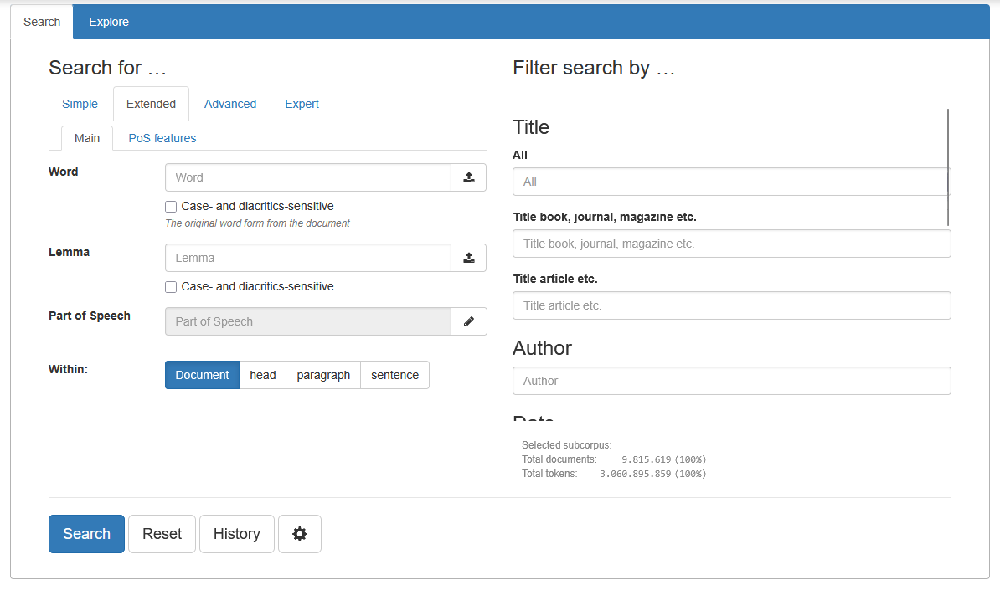

# Getting Started

There's [several examples online](/guide/#try-it-online) of what you can do with BlackLab.

But at some point, you're going to want to run it yourself so you can experiment with your own data.

Before you can search your data using BlackLab, you'll need to:

- Install BlackLab
- Prepare your data
- Index your data

Let's go over these one by one.

## Install BlackLab

The web service, BlackLab Server, can be used from any programming language and offers a simple REST API (web service).

You will need a JVM version of 17 or higher to use the latest BlackLab versions. Also install Apache Tomcat 9. For example, on Ubuntu:

```bash
sudo apt install openjdk-17-jdk tomcat9
```

Create an empty directory where you want to store your indexed corpora. Make sure it has the permissions you require. For example:

```bash
# Create directory
sudo mkdir -p /data/blacklab-corpora

# Make sure you own it, so you can create corpora there
sudo chown -R $USER:$GROUP /data/blacklab-corpora

# Make sure it's world-readable so Tomcat can read it
chmod -R a+rx /data/blacklab-corpora
```

Now create a directory `/etc/blacklab` with a file named `blacklab-server.yaml`:

```bash
# Create directory
sudo mkdir /etc/blacklab

# Create empty config file and take ownership of it
sudo touch /etc/blacklab/blacklab-server.yaml
sudo chown $USER:$GROUP /etc/blacklab/blacklab-server.yaml

# Make sure Tomcat can access the directory and file
sudo chmod -R a+rX /etc/blacklab
```

(NOTE: if you cannot create a directory under `/etc/`, see the TIP under [configuration file](../server/#configuration-file) for alternatives)

Now, edit the file `/etc/blacklab/blacklab-server.yaml` using a text editor:

```yaml
---
configVersion: 2

# Where indexes can be found
# (list directories whose subdirectories are indexes, or directories containing a single corpus)
indexLocations:
- /data/blacklab-corpora
```

On the [GitHub releases page](https://github.com/instituutnederlandsetaal/BlackLab/releases/), find the latest stable version (usually at the top) and download the attached file named `blacklab-server-VERSION.war`. Place this file in Tomcat's `webapps` directory. Tomcat should automatically recognize the file and initialize the application (usually, it will extract it to a subdirectory).

Now go to [https://localhost:8080/blacklab-server/](https://localhost:8080/blacklab-server/) (or substitute the hostname of the server you've installed it on if not running locally) and you should see an XML response from BlackLab.

*([learn more about BlackLab Server](../server/))*


## Prepare your data

In order to search your data using BlackLab, it needs to be in a supported format, and it needs to be indexed by BlackLab.


### Supported formats

BlackLab supports a number of input formats, but the most well-known are [TEI](https://www.tei-c.org/) (Text Encoding Initiative) and [FoLiA](https://proycon.github.io/folia/) (Format for Linguistic Annotation). These are both XML formats. If your data is not already in one of the supported formats, you can either [add support via a configuration file](index-your-data/simple-example.md) or convert your data to a supported format. (see the next section if you want to use a test dataset instead of your own)

::: warning PLEASE NOTE
BlackLab needs *tokenized* data files as input. That means the word boundaries have already been determined and BlackLab can just index each word as it parses the input file.

It is possible to configure BlackLab to perform the necessary tokenizing and tagging; see [Convert/Tag plugins](/development/customization/plugins.md).
:::


### Testing with the Brown corpus

If you can't use your own data yet, we've provided a [tokenized, annotated TEI version of the Brown corpus](https://github.com/instituutnederlandsetaal/BlackLab/wiki/brownCorpus.lemmatized.xml.zip) for you to test with. 

**NOTE:** to index this version of the Brown corpus, use the `tei-p5-legacy` input format.

::: details The Brown Corpus
The [Brown Corpus](http://en.wikipedia.org/wiki/Brown_Corpus "http://en.wikipedia.org/wiki/Brown_Corpus") is a corpus compiled in the 1960s by [Nelson Francis and Henry Kucera](http://archive.org/details/BrownCorpus) at Brown University. It is small by today's standard (500 documents, 1M words). It was converted to TEI format by [Lou Burnard](http://users.ox.ac.uk/~lou/). It is available from archive.org under the [CC-BY-NC 3.0](http://creativecommons.org/licenses/by-nc/3.0/) license, but we've created our own version which includes lemmata.<br/>(Please note that we didn't check the lemmatization, and it probably contains errors - useful for testing purposes only!)
:::


### Index the data

There's a commandline tool to create a corpus called `IndexTool`. To use it, also download the blacklab-core-VERSION.jar from the [GitHub releases page](https://github.com/instituutnederlandsetaal/BlackLab/releases/) and extract it somewhere convenient.

From this directory, run the IndexTool without parameters for help information:

```bash
java -cp "blacklab-VERSION.jar:lib" nl.inl.blacklab.tools.IndexTool
```

(NOTE: replace VERSION with the correct version. `blacklab-VERSION.jar` and the `lib` subdirectory containing required libraries should be located in the current directory; if not, prefix it with the correct directory)

(if you're on Windows, replace the classpath separator colon `:` with a semicolon `;`)

We want to create a new corpus, so we need to supply a corpus (index) directory, input file(s) and an input format:

```bash
java -cp "blacklab-VERSION.jar:lib" nl.inl.blacklab.tools.IndexTool create INDEX_DIR INPUT_FILES FORMAT
```

If you specify a directory as the `INPUT_FILES`, it will be scanned recursively. You can also specify a file glob (such as \*.xml) or a single file. If you specify a .zip or .tar.gz file, BlackLab will automatically index its contents.

For example, if you have TEI-P5 data in `/tmp/my-tei/` and want to create a corpus in `/data/blacklab-corpora/my-corpus`, run the following command:

```bash
java -cp "blacklab-VERSION.jar" nl.inl.blacklab.tools.IndexTool create /data/blacklab-corpora/my-corpus /tmp/my-tei/ tei-p5
```

(**NOTE:** for the included Brown corpus data, use the `tei-p5-legacy` input format)

Your data is indexed and placed in a new BlackLab corpus in the `/data/blacklab-corpora/my-corpus` directory.

::: details <b>TIP:</b> TEI variants

BlackLab now includes three TEI variants: `tei-p5` (TEI-P5 using the `pos` attribute), `tei-p5-legacy` (same but using the nonstandard `type` attribute for part of speech) and `tei-p4-legacy` (TEI-P4 using the `type` attribute). Make sure you pick the right variant for you, or copy one of the `tei-*.blf.yaml` files (see [here](@github:/engine/src/main/resources/formats)) and customize it to your needs.

:::

See also:

- [Adding a new input format](/guide/index-your-data/simple-example.md) (if your format isn't supported yet and you don't want to convert)
- [Indexing with BlackLab](/guide/index-your-data/create-an-index.md)

### Testing your corpus

#### BlackLab Server

If your corpus was created as a subdirectory of the `indexLocation` you configured above (`/data/blacklab-corpora` in the above example), BlackLab Server should pick it up automatically. You can test this by going to http://localhost:8080/blacklab-server/my-corpus. If it worked, you should see metadata about your corpus.

If you encounter problems, or you just prefer to test your corpus using a simple command line tool, you can try the [QueryTool](/development/query-tool.md).

## Corpus search application

BlackLab Frontend is our corpus search application. It has its own [documentation site](https://blacklab-frontend.ivdnt.org/) with instructions for installation and customization.



## A simple script

If you want to access your corpus using a script, that is easy as well.

Below is an example in Python. It performs a CQL query and shows matches in KWIC (keyword in context) format:

```python
import urllib.parse
import urllib.request
import json

def words(context):
	""" Convert word array to string. """
	return " ".join(context['word'])

def search(cqlQuery):
	""" Search and show hits. """
	url = "http://localhost:8080/blacklab-server/my-corpus/hits?patt=" + \
		urllib.parse.quote_plus(cqlQuery) + "&outputformat=json"
	f = urllib.request.urlopen(url)
	response = json.loads(f.read().decode('utf-8'))
	hits = response['hits']
	docs = response['docInfos']
	for hit in hits:
		# Show the document title and hit information
		doc = docs[hit['docPid']]
		print(words(hit['left']) + " [" + words(hit['match']) + "] " + \
			words(hit['right']) + " (" + doc['title'][0] + ")")

# "Main program"
search('[pos="a.*"] "fox"')
```

More examples can be found [here](../server/from-different-languages.md).
